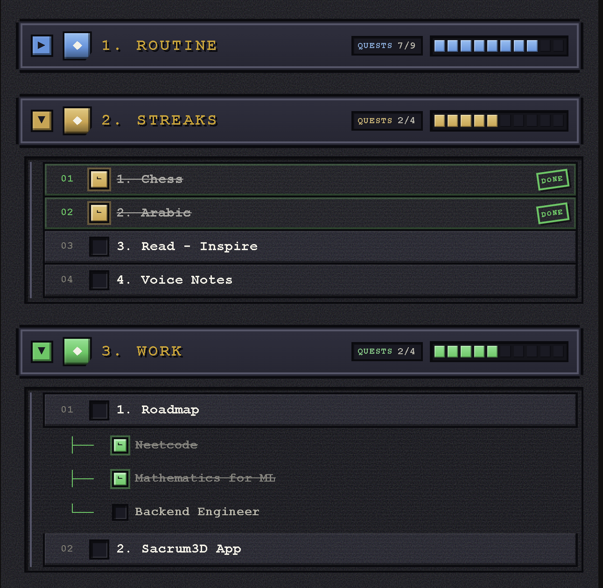
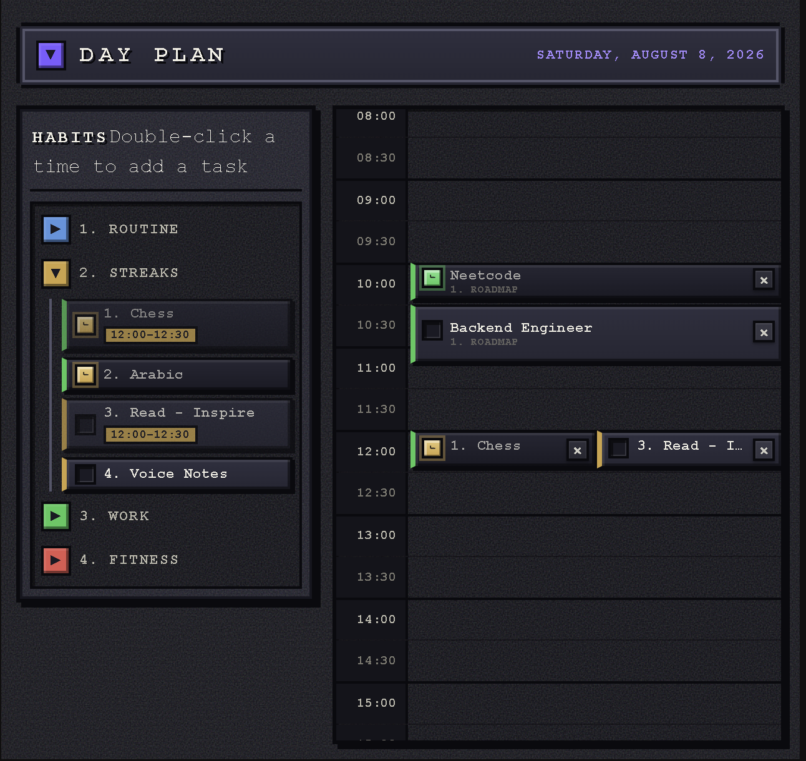
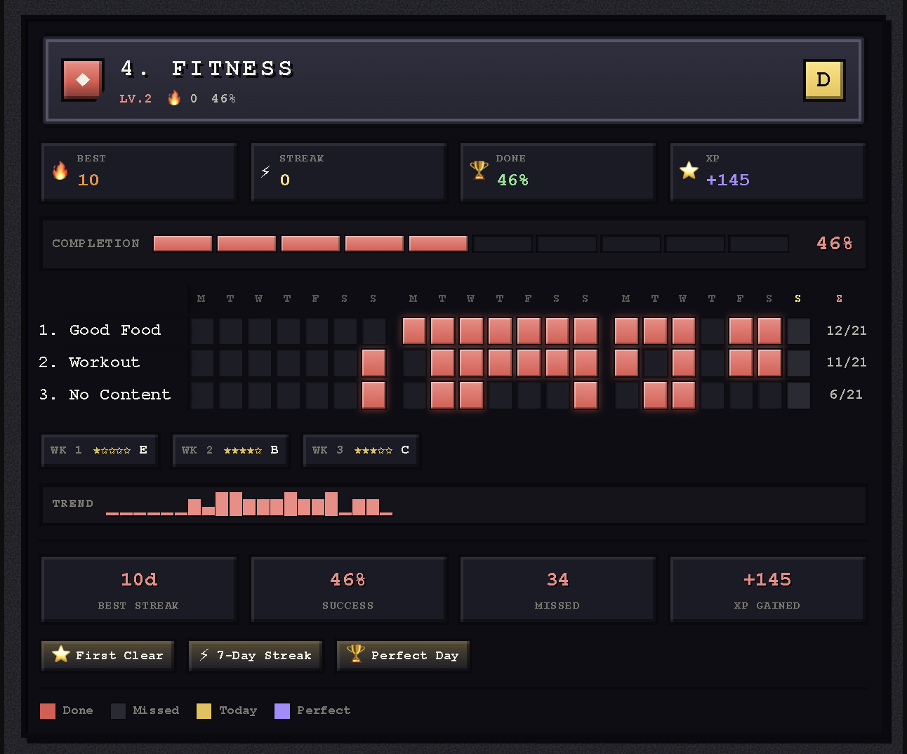

# Pixel Habits

Turn a folder of notes into a retro **16-bit RPG** habit tracker for [Obsidian](https://obsidian.md) — a checklist, a day planner, and a stats screen.

## Habits

Every note in your routines folder becomes a checkbox, grouped into colour-coded sections. Ticking one writes today's date into that note, so your history lives in your vault as plain frontmatter.



## Day plan

Drag habits from the tray into the day, stretch them to however long they really take, and check them off in place. Double-click an empty slot for a one-off task that isn't part of your routines.



## Stats

A JRPG character screen for your consistency: levels, ranks, XP, achievements, and a heatmap where streaks join into a single bar labelled with its length.



## Quick start

1. Install the plugin (see [Installation](#installation)) and put your habit notes in a `Routines` folder.
2. Add any of these code blocks to your daily note — there's an **Insert…** command for each:

````markdown
```routines
```

```pixel-calendar
```

```routine-stats
```
````

All three stay in sync as you click, and everything is stored in your notes' frontmatter.

---

# Reference

Everything below is optional detail — the plugin works out of the box.

## How it works

Point the plugin at a root folder (default: `Routines`). Each subfolder becomes a collapsible section, and each note inside becomes a checklist item:

```
Routines/
├── Fitness/
│   ├── Gym.md
│   └── Protein goal.md
└── Work/
    └── Inbox zero.md
```

Add a code block to your daily note (or use the **Insert routines checklist block** command):

````markdown
```routines
```
````

This renders a collapsible **Habits** checklist with **Fitness** and **Work** sections. When you check **Gym** in a daily note dated `2026-06-25`, that date is appended to the `entries` frontmatter property of `Fitness/Gym.md`:

```yaml
---
entries:
  - 2026-06-25
---
```

Unchecking removes the date. Checked items are shown with a strikethrough.

### Subtasks

A routine note can break a habit into subtasks by adding a `subtasks` list to its frontmatter:

```yaml
---
subtasks:
  - Warm up
  - Main set
  - Cool down
---
```

Each subtask renders as a nested checkbox under the habit, connected with pixel tree connectors (`├──` / `└──`). The parent and its subtasks stay in sync both ways:

- Checking **every** subtask automatically checks the parent and logs the daily note's date into `entries`.
- Unchecking any subtask automatically unchecks the parent and removes that date.
- Checking or unchecking the parent toggles **all** subtasks at once.
- If a note already has `entries` dates from before it had subtasks, those dates are automatically backfilled into every subtask on render, so the parent stays consistent.

Per-subtask completion is stored in a plugin-managed `subtaskEntries` property so it survives reloads:

```yaml
---
subtasks:
  - Warm up
  - Main set
subtaskEntries:
  Warm up:
    - 2026-06-25
  Main set:
    - 2026-06-25
entries:
  - 2026-06-25
---
```

Notes without a `subtasks` property behave exactly as before — a single checkbox.

## Pixel calendar

Plan your day by adding a `pixel-calendar` code block to your daily note (or use the **Insert pixel calendar block** command):

````markdown
```pixel-calendar
```
````

This renders a single-day planner titled **Day Plan** for the daily note's date, with 48 half-hour slots covering 24 hours. Every habit — and its subtasks — appears in a side tray:

- **Drag** a habit or subtask from the tray into any time slot to schedule it. The plan is saved to the daily note's `pixelCalendarPlan` frontmatter property, so it persists across reloads.
- **Double-click an empty time slot** to add a **one-off task** for that day — something that isn't one of your routines (see below).
- **Stretch** anything you've scheduled: drag the bottom edge of a block to make it span more time.
- **Check** any item — right inside its slot **or straight from the side tray** — this writes to `entries` / `subtaskEntries` exactly like the checklist (subtask/parent stay in sync), and both the tray and slot reflect the completion.
- **Remove** a scheduled item with the `×` button on its slot chip.
- **Collapse** the whole planner by clicking the **Day Plan** header, just like the checklist's top-level **Habits** toggle.
- The side tray's folder sections are an **accordion** — opening one section collapses the others, so at most one is expanded at a time.
- The row for the current half-hour is highlighted so you can see where you are in the day.
- Each chip — and its checkbox — is tinted with its habit's **section color**, matching the checklist.

```yaml
---
pixelCalendarPlan:
  "07:00":
    - Routines/Fitness/Gym.md
  "07:30":
    - "Routines/Fitness/Gym.md::Cool down"
---
```

### Durations

Every scheduled block starts as one 30-minute slot, but a habit rarely fits neatly into half an hour:

- **Drag the bottom edge** of a block to stretch it over as many rows as you need (snaps to 15 minutes).
- Moving a block to another slot **keeps its duration**, and overlapping blocks are shown side by side.
- The side tray shows each scheduled habit's full time range.

Anything other than a plain 30-minute slot is saved to the daily note's `pixelCalendarTimes` property:

```yaml
---
pixelCalendarTimes:
  Routines/Fitness/Gym.md:
    start: "07:10"
    end: "09:05"
---
```

### One-off tasks

Not everything is a routine. **Double-click any empty time slot** to type a task just for that day — no note is created and nothing is added to your routines folder:

- Press **Enter** to add it, **Escape** to cancel.
- **Check** it off like any other chip, **drag** it to another slot, or **double-click** it to rename.
- The `×` button (or dragging it back to the tray) **deletes** it.

One-off tasks are stored in the daily note's `pixelCalendarTasks` property and referenced from the plan with a `custom:` prefix:

```yaml
---
pixelCalendarPlan:
  "09:30":
    - custom:m3k9f2-a1b2
pixelCalendarTasks:
  m3k9f2-a1b2:
    title: Call the plumber
    done: true
---
```

### Live sync between blocks

The checklist, the pixel calendar, and the stats board stay in sync **as you click**. Checking a habit in the calendar instantly ticks it in the **Habits** checklist (updating its progress bars), and vice versa — no page refresh, no reopening the note.

## Stats board

Add a stats screen to **any** note with the `routine-stats` code block (or use the **Insert routine stats board** command):

````markdown
```routine-stats
```
````

This renders a retro RPG **character-stats screen** with one board per folder/section, showing the last **21 days**:

- **Header** — category banner, section title, level (`LV.n`), current streak, and a rank badge (S/A/B/C/D/E).
- **Quick stats** — best streak, current streak, completion %, and earned XP.
- **Completion HUD** — a block-based HP/XP-style progress bar.
- **Heatmap** — routines × days grid; completed days are filled in the section's color, grouped by week with per-row totals. **Consecutive completed days are joined into a single bar**, and the last day of each run is stamped with the streak length.
- **Weekly milestones** — star ratings and rank per week, with a special *Perfect Week* state.
- **Trend** — a pixel sparkline of daily completions.
- **Lifetime stats** — best streak, success rate, missed days, and XP gained.
- **Achievements** — collectible pixel badges (First Clear, 7-Day Streak, Perfect Day, Perfect Week, 100% Complete).

**Click any cell** in the heatmap to add or remove a completion for that routine on that day — it writes to the same `entries` (and fans out to subtasks) exactly like the checklist, and the board updates live.

## Settings

- **Routines folder** — vault-relative path to the root folder (default: `Routines`)
- **Entries property** — frontmatter property updated when an item is checked (default: `entries`)
- **Stored date format** — Moment format used for the date written into `entries` (default: `YYYY-MM-DD`)
- **Subtasks property** — frontmatter property that lists a note's subtasks (default: `subtasks`)
- **Subtask entries property** — frontmatter property where per-subtask completion dates are stored (default: `subtaskEntries`)
- **Pixel calendar property** — frontmatter property in the daily note where the pixel calendar plan is stored (default: `pixelCalendarPlan`)
- **Pixel calendar tasks property** — frontmatter property in the daily note where one-off calendar tasks are stored (default: `pixelCalendarTasks`)
- **Pixel calendar times property** — frontmatter property in the daily note where custom start/finish times are stored (default: `pixelCalendarTimes`)

## Installation

### From the Community Plugins browser

Once accepted: Settings → Community plugins → Browse → search for "Pixel Habits".

### Manual

1. Download `main.js`, `manifest.json`, and `styles.css` from the latest [release](https://github.com/shabbirpatheria/folder-routines/releases).
2. Copy them into `<vault>/.obsidian/plugins/folder-routines/`.
3. Reload Obsidian and enable the plugin under Settings → Community plugins.

## License

[MIT](LICENSE)
